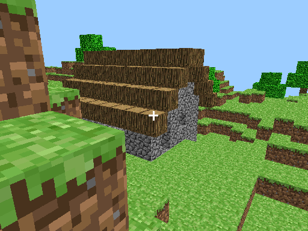

# Minecraft clone for the N64



## Build instructions

Requires the N64 SDK.

### 1. Extract Minecraft textures

Mine64 uses the textures and font from Minecraft Classic 0.30.
To build Mine64, you need to extract two files from your own copy of Minecraft Classic
as follows:

1. Install Minecraft Classic 0.30 from the Minecraft launcher.
2. Find `.minecraft/versions/c0.30_01c/c0.30_01c.jar` in your Minecraft folder.
3. Extract `default.png` and `terrain.png` from the jar file into the Mine64 project directory.
4. Create a directory called `assets` in the Mine64 project directory.
5. Run `python tex2c.py terrain.png` and `python font2c.py default.png`.

This should generate two header files in the `assets` directory.

### 2. Build Mine64

You will need Wine to run the SDK on a modern operating system. On Linux (or WSL),
run the following commands to build Mine64:

```
export ROOT=Z:\\path\\to\\ultra
export N64KITDIR=Z:\\path\\to\\n64kit
mkdir build
wine cmd.exe /c build.bat
```

The rom can be found at `build/mine64.n64`.

## Technical Details

* The world consists of a 8x8 grid of "columns", each split into 4 vertical chunks of 8x8x8 blocks each.
* For each chunk a greedy scanning algorithm merges adjacent block faces with the same texture,
to reduce the number of quads that need to be rendered.
* `quads.h` contains the vertex data for all possible shapes and orientations of merged quad.
These quads are translated into place for rendering.
* Display lists for each column are recomputed every time a block changes in the column.
* Columns outside the camera view are culled by excluding their display lists from the main display list.

## Acknowledgements

Mine64 uses nowl's Perlin noise implementation in C: https://gist.github.com/nowl/828013